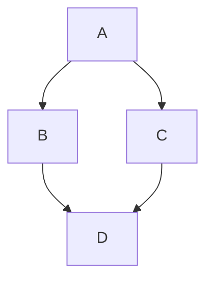

# Docs Example Page

This page is used for showing off plugins and styling available in this Docusaurus instance. For more info not listed here, check out the official [Docusaurus markdown features](https://docusaurus.io/docs/markdown-features).

Its best to view the raw markdown source of this page, which you can do [here](https://github.com/mqole/robust-docs/blob/main/docs/meta/docs-example-page.md?plain=1).

## Markdown

Best to look at [a general markdown guide](https://www.markdownguide.org/getting-started/) for this! There's a lot.

**bold**

*italic*

~~strikethrough~~

## Front Matter

Individual docs pages frontload metadata as front matter. Here's what this page's front matter looks like:

```
---
sidebar_position: 2
---
```

This metadata is parsed as `YAML`. In this case, we're telling this page to be at the 2nd position in the sidebar, putting it under the [Guide to Editing Docs](./guide-to-editing-docs).

## Admonitions

Docusaurus supports a few different admonition types.

Admonitions are formatted like this:
```
:::{type}[text you want as title, or leave blank]
description
:::
```

Here are the different types you can use:

:::note
:::

:::tip
:::

:::info
:::

:::warning
:::

:::danger
:::

## KaTex

You can use [KaTeX](https://katex.org/) to write math equations.

Block KaTeX can be written by wrapping your LaTeX equations in a `math` block:

```math
mu = \frac{1}{N} \sum_{i=0} x_i
```

Inline KaTeX can be written by wrapping your LaTeX equations in `$`.

```Silly Atmospherics maintainer, the derivation is written in $\KaTeX$, so it must be true!```

Silly Atmospherics maintainer, the derivation is written in $\KaTeX$, so it must be true!

## Mermaid

This wiki also supports [Mermaid](https://mermaid.ai/), which can be used to draw diagrams. Use the online [live editor](https://mermaid.ai/live/edit) to see some examples of what you can make using Mermaid!

