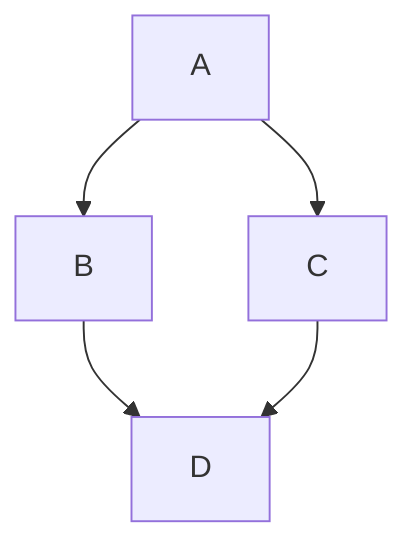

# Docs Example Page

This page is used for showing off plugins and styling available in this Docusaurus instance. For more info not listed here, check out the official [Docusaurus markdown features](https://docusaurus.io/docs/markdown-features).

Its best to view the raw markdown source of this page, which you can do [here](https://github.com/mqole/robust-docs/blob/main/docs/meta/docs-examples.md?plain=1).

## Markdown

Markdown is a lightweight language which is great for writing documentation. It supports a lot of basic forms of text styling. The best way to learn Markdown is to experiment with a side-by-side preview. Here's a link to a [Markdown playground](https://markdowncourse.com/playground) where you can try it in action!

Italicized text is `*formatted like this*` and *looks like this*.

Bolded text is `**formatted like this**` and **looks like this**.

You can also use `code snippets`, ~~strikethrough~~, and plenty more! Docusaurus' documentation page has a more [extensive list](https://docusaurus.io/docs/markdown-features).

## Front Matter

Individual docs pages frontload metadata as front matter. Here's what this page's front matter looks like:

```
---
sidebar_position: 2
---
```

This metadata is parsed as `YAML`. In this case, we're telling this page to be at the 2nd position in the sidebar, putting it under the [Guide to Editing Docs](./docs-contributing).

Front matter is used mostly in this site's backend, but feel free to mess around with it. [There's a lot you can use it for.](https://docusaurus.io/docs/api/plugins/@docusaurus/plugin-content-docs#markdown-front-matter)

## Admonitions

Docusaurus supports a few different admonition types.

Admonitions are formatted like this:
```
:::{type}[text you want as title, or leave blank]
description
:::
```

Here are the different types you can use:

:::note
:::

:::tip
:::

:::info
:::

:::warning
:::

:::danger
:::

## KaTex

You can use [KaTeX](https://katex.org/) to write math equations.

Block KaTeX can be written by wrapping your LaTeX equations in a `math` block:

```math
mu = \frac{1}{N} \sum_{i=0} x_i
```

Inline KaTeX can be written by wrapping your LaTeX equations in `$`.

```Silly Atmospherics maintainer, the derivation is written in $\KaTeX$, so it must be true!```

Silly Atmospherics maintainer, the derivation is written in $\KaTeX$, so it must be true!

## Mermaid

This wiki also supports [Mermaid](https://mermaid.ai/), which can be used to draw diagrams. Use the online [live editor](https://mermaid.ai/live/edit) to see some examples of what you can make using Mermaid!



## Glossary

The glossary in this wiki is built using the `docusaurus-plugin-glossary` plugin, documentation for which can be found [here](https://docusaurus-plugins.mcclowes.com/docs/glossary/overview). You can define a glossary term in the repository's `glossary/glossary.json` file, like this:

```json
{
    "term": "Robust Toolbox",
    "definition": "Custom game engine on which SS14 is built.",
    "aliases": ["RT", "Engine", "RobustToolbox"],
    "caseSensitive": true
},
```
And now, whenever I type Robust Toolbox, RT, Engine, or RobustToolbox in a docs file, you'll see an underlined definition which will automatically define that term when you hover over it.

You can also define abbreviations, and prevent a term from automatically being underlined:

```json
{
    "term": "SS14",
    "definition": "Space Station 14. Remake of Space Station 13 (SS13).",
    "abbreviation": "Space Station 14",
    "autoLink": false
},
```
When I type SS14, no link is generated. If I want to generate a link anyway, I just type `<GlossaryTerm term="SS14">SS14</GlossaryTerm>` like so. <GlossaryTerm term="SS14">You can make any text link to a term's definition this way.</GlossaryTerm> And note how hovering over that text will show you the unabbreviated form of SS14!