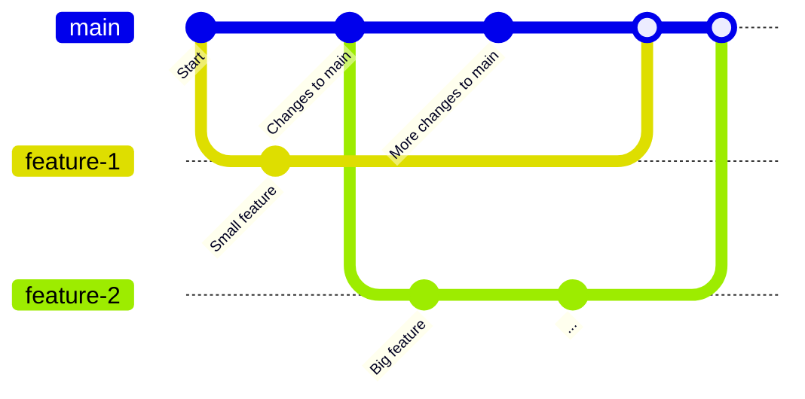

# Setting Up Git

## Downloading Git

:::info
This page will assume that you're using Git in the command line (a good habit to get into, especially if you're using an IDE!) but there are some alternatives that may appeal to you if you prefer working with a GUI:

- [TortoiseGit](https://tortoisegit.org/): old but gold Git GUI that shows info in the file explorer menu and makes basic stuff a breeze.
- [SmartGit](https://www.syntevo.com/smartgit/): fully featured Git GUI that's very customizable and simple to use.
- [Fork](https://git-fork.com/): fast and extremely ergonomic GUI. "Non-free", but it's WinRAR-level non-free, so it's basically free.
- [Sublime Merge](https://www.sublimemerge.com/): very similar to Fork, looks and feels great.

While these alternatives exist, its **very highly recommended** that you at least try using the command line before trying one of them!
:::

If you haven't already installed Git, go to [their website](https://git-scm.org) and install it now. This will install the Git backend, as well as Git Bash (if you select that option). If you're on Linux, you'll probably just be using Git through your terminal or whichever IDE you've chosen, and chances are you have it installed already.

While you're here, install `Python 3.7+` as well if you don't have it already. You can do that [here](https://www.python.org/) for Windows and Mac, and if you're on Linux you almost certainly have Python installed already.

:::danger[Name and Email privacy]
When [setting up your `user.name` and `user.email`](https://git-scm.com/book/en/v2/Getting-Started-First-Time-Git-Setup#_your_identity), know that these are publicly displayed on all commits that you create. If you want to keep your information private, you can set `user.name` to your username instead of your real name, and `user.email` to the one provided by GitHub when the [`Keep my email addresses private`](https://github.com/settings/emails#toggle_visibility) setting is checked in [GitHub Email Settings](https://github.com/settings/emails#primary_email_select_label).
:::

We're going to run through the process of setting up a Git environment for Space Station 14 so that you can **contribute code through pull requests, create your own codebase**, or just **check out the history of the project.**

## Repositories

A repository is just a fancy name for a codebase. Repositories contain some **branches**, and those branches contain different **commits**.

A **remote** repository is just a repository's that's on GitHub. A **local** repository is one that's actually on your computer.

### Remote Repository

This repository is the one on GitHub.

First, let's make our own remote repository fork of Space Station 14. You'll need a GitHub account for this. 'Forking' a repository just means you're copying all of the repository's history and changes into your own remote repository so that you can do stuff freely to the code.

Navigate to the [Space Station 14 repository](https://github.com/space-wizards/space-station-14) and click here:


From there, it'll ask you where to fork it and what to name it--just to your regular account, and name it whatever you please! (but you'll probably want to stick with the default name.)

:::info
GitHub doesn't let you create multiple forks of a single project, so if you're working on multiple downstreams, or a downstream and an upstream simultaneously, you'll need to make a new repository and/or configure your local [remotes](#3-setting-up-local-remotes) to point to the desired upstream.
:::

### Local Repository

This repository is the one on your computer.

Now, we'll need to download our remote repository onto our computer (**cloning**) so we can add ~~20 pairs of clown shoes to every locker~~ some changes to it. You *can* technically make edits to your remote repository via GitHub, but having it on your computer means you can use IDEs like Visual Studio or Rider to build the game and run tests, as well as handle Git stuff easily.

Navigate to somewhere on your computer where you want to put the local repository, and right click:


Then, we'll enter the command for cloning **our** remote repository (not the `space-wizards/space-station-14` repository): 

```bash
git clone https://github.com/[your-github-username]/space-station-14.git
```

Then **c**hange **d**irectory using the name of your repository, the default command being:

```bash
cd space-station-14
```

:::note
Every Git command will look something like this--`git` and then a keyword like `add`, `commit`, `pull`, etc.
:::

After this completes, you have a local repository that you can now modify! The last step is to initialize our submodules.

### Submodules

A submodule is basically just a repository within a repository. Space Station 14 has a *lot* of submodules, most notably the engine, RobustToolbox.

Usually submodules have to be updated manually, but SS14 has an automatic submodule updater so you don’t have to worry about running `git submodule update --init --recursive` (the command for manually updating submodules) all the time.

Run `RUN_THIS.py` inside the repo you downloaded with Python. This should take a few seconds. If it instantly stops, you're either up to date or you need to make sure you have the latest version of Python. 

:::info
If you are on Windows and get redirected to the Microsoft Store, or encounter a message in your terminal claiming that Python is not installed when you attempt to run the above command, you will need to disable the Microsoft shortcut that might be causing this issue. You can do this by searching for `Manage App Execution Aliases` in the Windows search and then turning off the two Python references.

And, of course, if for some reason `RUN_THIS.py` refuses to work, you can always just run `git submodule update --init --recursive`.
:::

If you do want to modify the engine directly, or you want to update the submodule manually, make a file called `DISABLE_SUBMODULE_AUTOUPDATE` inside the BuildChecker/ directory.

If you ever need to manually update RobustToolbox, you can `cd RobustToolbox`, `git checkout [PUT THE VERSION NUMBER HERE]`, then `cd..\` to get back into your SS14 repo.

## Remotes

When you cloned your remote repository, a new **remote** was automatically added to your local repository. **Remotes** are just names that each point to the URL of a remote repository. When you're pulling (downloading changes) or pushing (uploading changes) between local and remote repositories, you can specify the name of a remote to change which remote repository you're interfacing with.

To put it a bit more simply: *remotes* and *remote repositories* are the same thing, but the remotes that are stored in your local repository can be given unique names so you don't have to type out the full URL every time you want to access that remote.

In this case, the remote automatically added is called `origin` and it points to `https://github.com/[username-here]/space-station-14` (or whatever you named the remote repository).

One issue: we don't have a reference to the original `space-wizards/space-station-14` remote repository anywhere, which we'll need if we want to pull any updates made by our upstream! So let's make sure we've navigated inside our local repo's folder, and we'll add a new remote. You can name your remote whatever you want, but for this example, we're going to call it `upstream`:

```bash
git remote add upstream https://github.com/space-wizards/space-station-14
```

Now, if you use the command `git remote`, you should see a list of all your remote names. If you use the command `git remote -v` (`-v` for 'verbose'), you'll be able to see the URLs which each remote points to!

:::info[What's an Upstream?]
'Upstream' and 'downstream' are terms used to refer to the relative position of different Git repositories. When you fork a repository, that repository becomes your upstream, and your forked repository is the downstream. 'Upstream' can also be used as a verb: if you decide to push changes that you make on your downstream fork to your relative upstream, you are 'upstreaming' those changes. Think of it like a river where changes made to the original upstream repository flow downstream to you!
:::

:::warning[For forks and downstream developers]
If a downstream repository you wish to contribute to is set up as a direct fork (IE: GitHub shows a "forked from" label underneath the repo's name), then you may want to add that fork as an additional remote. Just use the `git remote add [remote name] [remote URL]` command, substituting your preferred name and the repository's URL.

You can have as many remotes as you like in a single repository, and switch between them depending on what fork you want to work on. If you plan to work on a lot of forks, however, it may be easier to manually set up those remotes in an empty repository to keep your project organized. You can create an empty repository either through `git clone`ing a new project on GitHub, or running `git init` in an empty folder on your machine. Using `clone` will automatically add an `origin` remote, but if you're making a repository locally you can add your remote manually. From there, just add a remote to your desired upstream!
:::

## Commits

**Commits** are packaged up changes to the code. As the developer, you choose which changes go into a commit and when to commit those changes. **Committing** refers to creating a commit, and it essentially makes a save point that you can go back to at any time.

Commits have an author, timestamp, a message, and some code changes attached to them. They also have a really long 'commit hash', a unique identifier used to refer to different commits.

Commits are how history is built up. You can actually view the history of every single commit made to the SS14 repository from the beginning, which is pretty cool:


(viewable with `git log --reverse`)

## Branches

**Branches** are basically just individual lists of commits. The default branch is `master` (or sometimes `main` on differently-organized projects), and game servers use that branch to compile the code. 

You're pretty much always 'on a branch' when you're working with your code. You can use the command `git branch` to show a list of all your local branches, and `git checkout [branch name]` to switch between branches.

You can make as many branches as you like using `git branch [new branch name]` to create a branch without switching to it. To create a new branch and switch to that branch right away, use `git checkout -b [new branch name]`, where `-b` is short for 'branch'.

After you make a few commits to your branch, you can `merge` that branch into the main branch you want to work with. GitHub [pull requests](./pull-request) are really just a 'merge request', where you're making a request to merge the commits on your branch into another branch on the relevant repository (usually their `master` branch). For this reason, if your end goal is to make a pull request, you probably won't need to use the `merge` command, because you'll want to keep your master branch clean. For the sake of this guide, we'll just be talking about merging branches in the context of pull requests.

::::::danger[About keeping your master branch clean]
**Never commit new changes to your master branch!**

Technically you *can* just do all of your work on the `master` branch and pull request from there. But, creating different branches makes it easy to understand where you are, how many changes you've made, and it makes it possible to work on multiple features at once. If you start working on a feature using your master branch, and suddenly decide you want to work on another feature halfway through, you won't be able to get rid of any of the commits you've already made on your master branch!

:::warning
When you create a branch, it retains all commits from the current branch you're on. For this reason it's **generally very important** that you `git checkout master` before you create a new branch, so you aren't accidentally including changes you don't want on your new branch!
:::
::::::

Sometimes the branch you want to merge into will have made modifications to a file which your feature branch has *also* made modifications to. In this instance, you'll run into a merge conflict, which you'll have to resolve. Resolving merge conflicts can sometimes be very easy, and sometimes its *very annoying*. Read more about that [here](./merge-conflicts.md).

Here's an example diagram showing the commit timeline on three different branches ('main', 'feature-1', and 'feature-2'). Each circular node is its own commit. You can see at what points the commits on feature branches veer off from the main branch, and the **merge commits** on the main branch which fold the changes on each feature branch into the main branch.



### Staging Changes

One more important thing: Before you can `commit` your changes, you have to `add` your changes to the **staging area**. All this means is that you're specifying which files you want to commit. This is helpful, because you *almost never* want to commit submodule changes, so you avoid that by not adding them to the staging area. 

If you want to see what you've currently changed, and what's in the staging area, you can use the command `git status`:


Here you can see that we've deleted one file: `README.md`. Now, we'll add all our changes to the staging area by using `git add -a` (`-a` for 'all'), and `git commit -m [commit message]` (`-m` for 'message') to commit only our staged changes.

If you want to only add specific files, you can substitute the `-a` in `git add -a` for the filepath (for example, `git add README.md`). You can remove files from the staging area by using `rm` in place of `add` (`rm` being short for 'remove').


Congratulations, you've just made a commit!

## Pushing Local Changes

It's pretty easy to push our changes now that we've committed them. Be aware that, when using these commands, Git is probably going to ask for your GitHub credentials so that it can verify that you're allowed to push to that remote.

When pushing changes, we specify the *remote* repository that we're pushing to and the *local* branch that we're pushing: in this instance, we want to push to the remote URL that we've given the name `origin`, and the branch we want to push is named `funny-feature`. So the command we want to use is `git push origin funny-feature`.


Now if we visit our remote repository on GitHub's website, we should be able to see our new branch there!

## Updating your Repository

Maybe it's been a while since you've last opened your local repository, and you need to make sure you're keeping it up-to-date with all the changes being made by your relative upstream. If you don't, you'll have out-of-date code and your local changes may not be accurate to how the game will actually run. You may even get merge conflicts when you try to PR.

To update your repository, you'll first need to have set up the `upstream` remote (or, if you're working on a downstream, whichever remote corresponds to your relative upstream).

### Fetching

Fetching refers to downloading the new branches and commits from a remote repository so they can be accessed locally. Fetching from a remote repository doesn't make any changes to your local repository, but it does create copies of all that remote's branches on your local machine, which you can then access.

Remote branches that are downloaded to your local repository when you run `git fetch [remote name]` are automatically assigned branch names that combine the name of the remote and the name of the branch. For example, when you use the command `git fetch upstream`, it'll make a branch called `upstream/master`. Once you've downloaded a branch like this, it basically functions the same as a normal branch would.

If you `git fetch` and you don't see a command output, don't worry. It may just mean your local repository is up-to-date with that remote.

### Pulling

Pulling (the opposite of '[pushing](#pushing-local-changes)') refers to the process of integrating commits made on one branch into the other. Git has a nice system for automatically figuring out which remote you want to fetch from (but it doesn't always work cleanly). 

First make sure to `checkout` the branch you want to pull your changes onto, then just run `git pull [target remote] [branch in that remote]`.

In our case, we've already run `git fetch upstream` and `git checkout master`, so we can just run `git pull upstream master` to pull all of the new commits from our upstream's remote repository to our local `master` branch:


Sometimes when you pull changes, you may need to resolve merge conflicts, just like when you merge branches. Read more about that [here](./merge-conflicts.md)